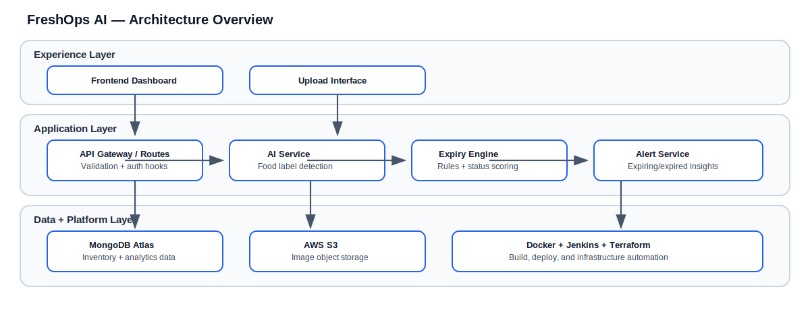

# FreshOps AI

FreshOps AI is a smart perishable intelligence platform designed to help food-driven teams make better decisions before inventory becomes waste. It combines image-based item capture, AI-assisted detection, expiry intelligence, and operational dashboards into one practical workflow.

Whether you are building this for a retail use case, a cloud kitchen, a campus canteen, or a warehouse MVP, the goal is the same: **see risk early, act faster, and reduce avoidable loss**.

---

## Problem Statement

Perishable operations are still largely reactive:

- teams discover expired stock too late,
- visibility across locations is fragmented,
- and inventory insights are often manual or delayed.

This leads to preventable waste, margin leakage, and inconsistent replenishment decisions.

FreshOps AI addresses this by turning day-to-day inventory signals into real-time, explainable intelligence:

- detect what was added,
- estimate freshness windows,
- classify risk states,
- and surface actionable alerts.

---

## End-to-End Flow


1. User uploads a perishable item image (with optional metadata).
2. AI service detects the most relevant food/item label.
3. Expiry engine maps item/category to shelf-life rules.
4. System stores item record, status, and predicted expiry timeline.
5. Dashboard and alerts layer surfaces what needs attention now.

---

## Architecture Overview



FreshOps AI follows a modular, backend-first architecture:

- **Frontend layer** for uploads, inventory views, alerts, and business summaries.
- **Backend layer** for API orchestration, validation, AI integration, expiry logic, and response shaping.
- **Data layer** for structured inventory records and image persistence.
- **Platform layer** for containerization, CI/CD automation, and infrastructure provisioning.

This separation keeps the MVP simple while making it straightforward to scale services independently as usage grows.

---

## Tech Stack

Current/target stack for this repository:

- **Frontend:** React-based dashboard UI (planned structure under `frontend/`).
- **Backend:** Node.js + Express REST APIs (planned structure under `backend/`).
- **Database:** MongoDB Atlas via Mongoose.
- **AI Layer:** Clarifai-based food label detection integration.
- **File Storage:** AWS S3 for image persistence.
- **Containerization:** Docker + Docker Compose for local and deployment parity.
- **CI/CD:** Jenkins pipeline for build, test, and deploy automation.
- **Infrastructure:** Terraform for AWS provisioning (EC2, S3, security groups).

---

## Project Structure

```text
FreshOpsAI/
├── frontend/      # React UI, dashboard, upload flows
├── backend/       # Express APIs, services, models, expiry logic
├── docker/        # Dockerfiles, compose, container runtime assets
├── terraform/     # AWS infrastructure as code
├── jenkins/       # CI/CD pipeline assets and helpers
└── docs/          # Architecture, prompts, and project documentation
```

---

## Planned Features

### Core MVP

- Image upload pipeline with AI-assisted item detection.
- Rule-based expiry prediction with status buckets (`fresh`, `expiring-soon`, `expired`).
- Inventory listing and alert endpoints.
- Executive-friendly dashboard summary (counts + waste percentage).

### Near-Term Enhancements

- Better label-to-category mapping for more accurate expiry inference.
- Multi-location support and role-based access.
- Alert subscriptions (email/Slack/WhatsApp) for expiring stock.
- Trend analytics for waste reduction and procurement planning.

### Interview-Ready Direction

- Demonstrate clear domain problem ownership.
- Show practical AI usage without overengineering.
- Highlight DevOps maturity: Docker, Jenkins, Terraform, cloud deployment path.

---

## Deployment Story

FreshOps AI is designed as a practical MVP that can evolve into production safely:

1. **Build locally** with backend + frontend development flow.
2. **Containerize services** for consistent runtime behavior.
3. **Provision infrastructure** on AWS using Terraform.
4. **Automate CI/CD** through Jenkins pipelines.
5. **Deploy to EC2** with S3-backed image storage and cloud-friendly logging.

This progression intentionally mirrors how a real product moves from prototype to dependable operations.

---

## Why This Project Matters

FreshOps AI is not just a demo app; it is a business-minded engineering project. It combines product thinking, backend system design, applied AI integration, and deployment discipline in one cohesive platform that is easy to discuss in GitHub reviews and technical interviews.
