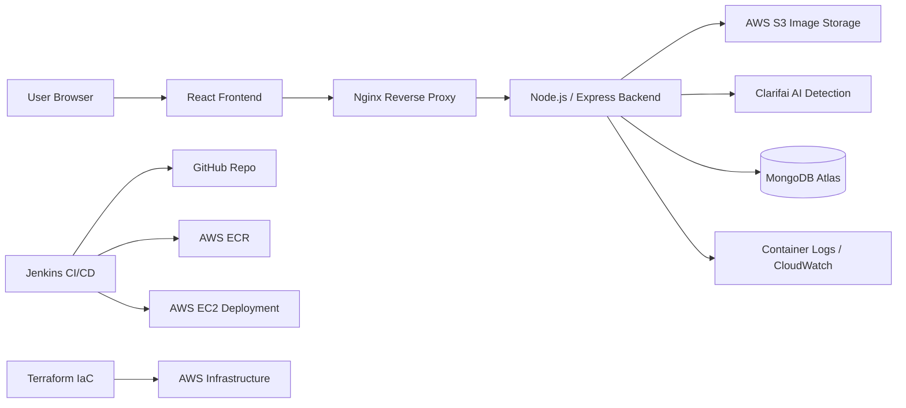
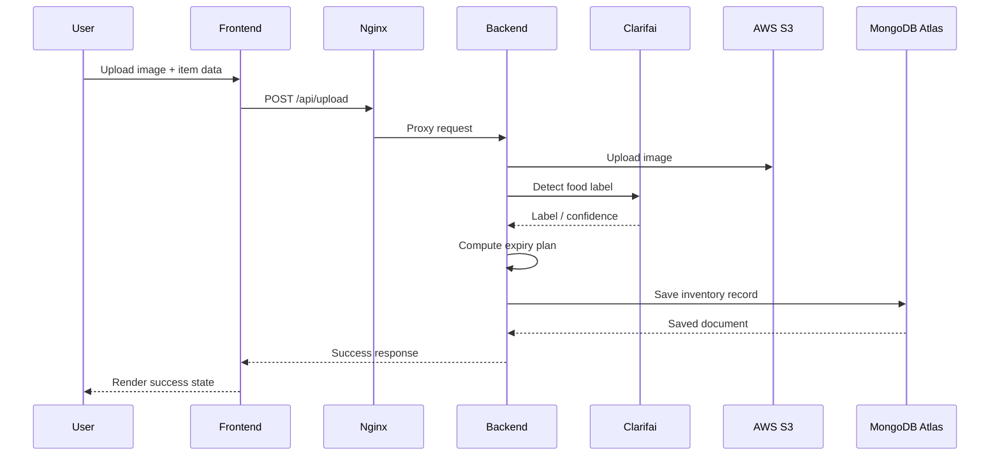
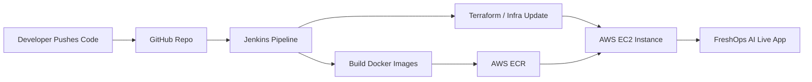

<title>FreshOps AI</title>

# FreshOps AI Full Project Report

**Report Date:** 2026-04-28  
**Project:** FreshOps AI  
**Repository:** `Ayush277/FreshOpsAI`

## 1. Executive Summary

FreshOps AI is a perishable inventory intelligence platform that helps teams track food items from image upload to expiry prediction, storage, and dashboarding. The system combines a React frontend, a Node.js/Express backend, MongoDB Atlas for inventory persistence, AWS S3 for image storage, Clarifai for image-based label detection, Docker for containerization, Jenkins for CI/CD, Terraform for infrastructure provisioning, and AWS for cloud deployment.

The project is designed as a production-style MVP: users upload an image, the backend detects or infers the item, assigns an expiry plan, stores the record in the database, and exposes a web dashboard for operational visibility.

## 2. Problem Statement

Food businesses lose money when perishable stock is not monitored in real time. Manual checks are slow, records are scattered, and expiry risk is often discovered too late. FreshOps AI solves this by turning a food image into a structured inventory record with an expiry timeline and cloud persistence.

## 3. What the Product Does

- Accepts food or inventory images from a browser UI.
- Uploads images to cloud storage.
- Detects the food item/category through AI integration.
- Calculates an expiry estimate based on simple shelf-life rules.
- Stores inventory metadata in MongoDB.
- Displays items, alerts, and summary metrics on the dashboard.
- Supports containerized local development and cloud deployment.

## 4. End-to-End User Flow

1. A user opens the frontend in the browser.
2. The user fills the upload form and selects an image.
3. The frontend sends a multipart request to `/api/upload`.
4. Nginx proxies the request to the backend container.
5. The backend validates the payload.
6. The backend uploads the image to AWS S3.
7. The backend detects the item label via Clarifai, or falls back to a manual/category-based rule if AI is unavailable.
8. The expiry engine calculates `expiryDate`, `daysRemaining`, and `status`.
9. The backend stores the record in MongoDB Atlas.
10. The frontend refreshes the list and dashboard views.

## 5. High-Level Architecture



### Architecture Notes

- The frontend is a single-page application served by Nginx in production.
- The backend is an API service that performs validation, image handling, AI orchestration, and persistence.
- MongoDB Atlas stores inventory records.
- AWS S3 stores uploaded images permanently.
- Jenkins and Terraform provide the DevOps and infrastructure automation layers.

## 6. Component Breakdown

### 6.1 Frontend

**Location:** `frontend/`

**Tech Stack:** React 19, Vite, React Router, date-fns, Nginx for production serving.

**Responsibilities:**

- Upload images and item metadata.
- Display inventory cards/table.
- Show dashboard summary and alerts.
- Handle success, loading, and error states.
- Send API requests to `/api/*` endpoints.

**Important runtime files:**

- `frontend/src/main.jsx`
- `frontend/src/App.jsx`
- `frontend/src/pages/`
- `frontend/src/components/`
- `frontend/Dockerfile`

### 6.2 Backend

**Location:** `backend/`

**Tech Stack:** Node.js, Express 5, Mongoose, MongoDB driver, Multer, AWS SDK S3.

**Responsibilities:**

- Accept multipart upload requests.
- Validate item name, category, and image.
- Upload images to S3.
- Detect food labels via Clarifai.
- Apply expiry rules.
- Save inventory data in MongoDB Atlas.
- Expose REST APIs for items, alerts, dashboard summary, and health checks.

**Important runtime files:**

- `backend/src/server.js`
- `backend/src/app.js`
- `backend/src/routes/`
- `backend/src/controllers/`
- `backend/src/services/`
- `backend/src/models/`
- `backend/Dockerfile`

### 6.3 Database

**Storage:** MongoDB Atlas

MongoDB is used to persist the business inventory record.

Typical fields stored:

- `itemName`
- `category`
- `imageUrl`
- `detectedAt`
- `expiryDate`
- `daysRemaining`
- `status`
- `createdAt`
- `updatedAt`

### 6.4 Cloud Storage

**Storage:** AWS S3

Images are uploaded to S3 so the backend does not need to keep local file state. The database stores the final image URL and related object metadata.

### 6.5 AI Layer

**Service:** Clarifai

Clarifai is used to classify uploaded food images. The implementation is designed to be optional and to fail gracefully if AI credentials are not configured.

### 6.6 Expiry Engine

The expiry engine uses simple shelf-life rules for the MVP.

Example mapping:

- Milk → 3 days
- Bread → 5 days
- Fruits → 7 days
- Vegetables → 6 days
- Yogurt → 7 days
- Unknown items → default shelf-life rule

## 7. Backend API Surface

The report below reflects the implemented product pattern and the endpoints documented in the project docs.

| Method | Endpoint | Purpose |
|---|---|---|
| `POST` | `/api/upload` | Upload image and create inventory item |
| `GET` | `/api/items` | Fetch inventory list |
| `GET` | `/api/alerts` | Fetch expiring/expired items |
| `GET` | `/api/dashboard/summary` | Get summary metrics |
| `GET` | `/health` | Health check |

### Upload Flow Response

The upload endpoint returns:

- saved item record
- computed expiry plan
- S3 file metadata
- AI detection result or fallback info

## 8. Frontend UX and Pages

The frontend is structured as a business dashboard rather than a demo app.

Expected screens/components:

- **Upload page**: Select image, enter item name, choose category, submit.
- **Inventory view**: Show all stored items and status values.
- **Alerts view**: Highlight expired and expiring-soon items.
- **Dashboard summary**: Total items, fresh count, expiring-soon count, expired count, and waste percentage.

## 9. Data Flow Diagram



## 10. Repository Structure

```text
FreshOpsAI/
├── backend/
│   ├── src/
│   │   ├── app.js
│   │   ├── server.js
│   │   ├── config/
│   │   ├── controllers/
│   │   ├── middleware/
│   │   ├── models/
│   │   ├── routes/
│   │   ├── services/
│   │   └── utils/
│   ├── Dockerfile
│   └── package.json
├── frontend/
│   ├── src/
│   │   ├── App.jsx
│   │   ├── components/
│   │   ├── hooks/
│   │   ├── pages/
│   │   ├── services/
│   │   └── styles/
│   ├── Dockerfile
│   └── package.json
├── terraform/
│   ├── main.tf
│   ├── outputs.tf
│   ├── provider.tf
│   └── variables.tf
├── jenkins/
├── docker-compose.yml
├── docker-compose.prod.yml
├── Jenkinsfile
└── docs/
```

## 11. Docker and Containerization

### Backend Container

- Base image: `node:22-alpine`
- Exposes port `4000`
- Runs as non-root user
- Uses `npm ci --omit=dev`

### Frontend Container

- Multi-stage build with Node + Nginx
- Builds static Vite assets in the first stage
- Serves the app through Nginx on port `80`
- Proxies `/api/` to the backend container on port `4000`
- Allows larger image uploads via `client_max_body_size 50M`

### Local Orchestration

The root `docker-compose.yml` starts the frontend and backend together.

The production override `docker-compose.prod.yml` adjusts:

- public port mapping
- restart policy
- EC2-friendly runtime behavior
- optional CloudWatch logging configuration

## 12. DevOps / CI-CD / Infrastructure

### 12.1 Jenkins

**File:** `Jenkinsfile`

Pipeline stages present in the repo:

1. Checkout source
2. Build backend image
3. Build frontend image
4. Optional tests
5. Push images
6. Deploy application

This makes the project suitable for demonstrating pipeline automation in an interview.

### 12.2 Terraform

**Location:** `terraform/`

Terraform currently defines:

- AWS provider configuration
- EC2 security group
- EC2 instance
- S3 bucket
- S3 public-read policy
- CORS configuration

This gives the project a real Infrastructure-as-Code story.

### 12.3 AWS Deployment

The project supports a single-instance EC2 deployment with Docker Compose.

Cloud resources used in the current setup:

- EC2 for hosting the app
- ECR for container images
- S3 for image assets
- MongoDB Atlas for persistence

### 12.4 One-Click Automation Story

This is the strongest DevOps narrative for the project:



In plain words: one push can trigger CI/CD, build the app, provision or update infrastructure, and deploy the latest version automatically.

## 13. Current Environment Variables

The backend expects environment-based configuration for all external services.

Common variables used by the project:

- `NODE_ENV`
- `PORT`
- `CORS_ORIGIN`
- `MONGODB_URI`
- `AWS_REGION`
- `AWS_ACCESS_KEY_ID`
- `AWS_SECRET_ACCESS_KEY`
- `AWS_S3_BUCKET`
- `AWS_S3_PREFIX`
- `AWS_S3_PUBLIC_BASE_URL`
- `CLARIFAI_PAT`
- `CLARIFAI_USER_ID`
- `CLARIFAI_APP_ID`
- `CLARIFAI_MODEL_ID`

## 14. Observability and Logging

The backend emits structured logs, which are suitable for container logs and CloudWatch-style ingestion.

Recommended practices:

- Log startup diagnostics for MongoDB, AWS, and Clarifai.
- Emit JSON-like structured log lines.
- Keep health checks separate from business APIs.
- Tail logs from Docker or AWS console during deployment.

## 15. Security Considerations

The project already demonstrates practical security controls:

- Non-root backend container execution.
- Environment-based secrets.
- MongoDB Atlas network access control.
- AWS S3-based image storage instead of local persistence.
- Reverse proxy separation between frontend and backend.

Recommended follow-ups:

- Rotate all cloud credentials after demos.
- Restrict SSH access on EC2 to known IPs.
- Prefer IAM roles over hardcoded AWS keys in production.
- Use a secrets manager for long-term maintenance.

## 16. Validation and Proof of Work

Based on the live deployment work completed during the project, the stack has been validated through:

- Successful image upload to S3.
- Successful inventory persistence in MongoDB.
- Successful frontend and backend health checks.
- Dockerized local and EC2 deployment.
- ECR image publishing.
- Nginx proxy routing.

This confirms the project is not just a design exercise; it is a functioning end-to-end system.

## 17. Current Live Deployment Snapshot

At the time of this report, FreshOps AI has been deployed and verified on AWS EC2 using Docker Compose and ECR-hosted container images.

| Item | Value |
|---|---|
| Frontend | Nginx container on port `8080` |
| Backend | Express container on port `4000` |
| Image Registry | AWS ECR |
| Persistence | MongoDB Atlas |
| Image Storage | AWS S3 |
| Cloud Host | AWS EC2 |

Verified live behaviors:

- Frontend responds over HTTP.
- Backend health endpoint responds successfully.
- Upload flow stores images and item records correctly.
- Cloud containers are started from Docker Compose on the EC2 host.

## 18. Interview Talking Points

If you are presenting this project in an interview, highlight these points:

1. **Full-stack breadth**: React frontend + Node/Express backend.
2. **Cloud storage**: S3 for durable image storage.
3. **Database design**: MongoDB Atlas for inventory state and expiry metadata.
4. **Automation**: Jenkins and Terraform for deployment/infrastructure.
5. **Containerization**: Docker for consistent local and cloud execution.
6. **Operational readiness**: structured logs, health checks, proxy routing, and cloud deployment.
7. **Business value**: reducing waste through image-driven perishable tracking.

## 19. Current Summary

FreshOps AI covers the full product stack:

- UI for upload and dashboards
- API orchestration and persistence
- AI-assisted food detection
- Expiry logic
- Cloud image storage
- Docker + Jenkins + Terraform DevOps story
- AWS deployment

That combination makes it an effective portfolio project because it demonstrates both application engineering and system design.

## 20. Recommended Next Additions

If you want to make the report even stronger, consider adding:

- Screenshots of the upload page and dashboard.
- A live architecture diagram image export.
- A screenshot of the AWS EC2 instance and ECR repositories.
- A short section on lessons learned and debugging wins.
- A demo video link or GIF.

---

**End of report.**